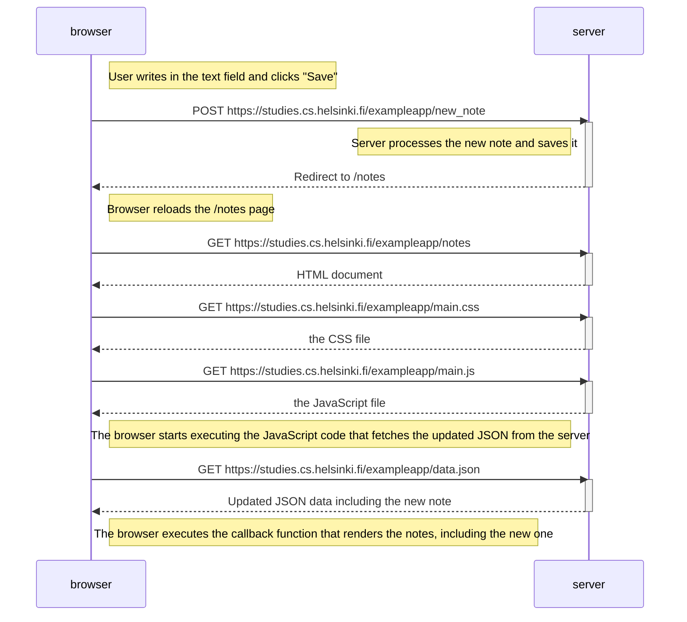

```mermaid

sequenceDiagram
    participant browser
    participant server

    Note right of browser: User writes in the text field and clicks "Save"
    browser->>server: POST https://studies.cs.helsinki.fi/exampleapp/new_note
    activate server
    Note left of server: Server processes the new note and saves it
    server-->>browser: Redirect to /notes
    deactivate server

    Note right of browser: Browser reloads the /notes page
    browser->>server: GET https://studies.cs.helsinki.fi/exampleapp/notes
    activate server
    server-->>browser: HTML document
    deactivate server

    browser->>server: GET https://studies.cs.helsinki.fi/exampleapp/main.css
    activate server
    server-->>browser: the CSS file
    deactivate server

    browser->>server: GET https://studies.cs.helsinki.fi/exampleapp/main.js
    activate server
    server-->>browser: the JavaScript file
    deactivate server

    Note right of browser: The browser starts executing the JavaScript code that fetches the updated JSON from the server

    browser->>server: GET https://studies.cs.helsinki.fi/exampleapp/data.json
    activate server
    server-->>browser: Updated JSON data including the new note
    deactivate server

    Note right of browser: The browser executes the callback function that renders the notes, including the new one


```