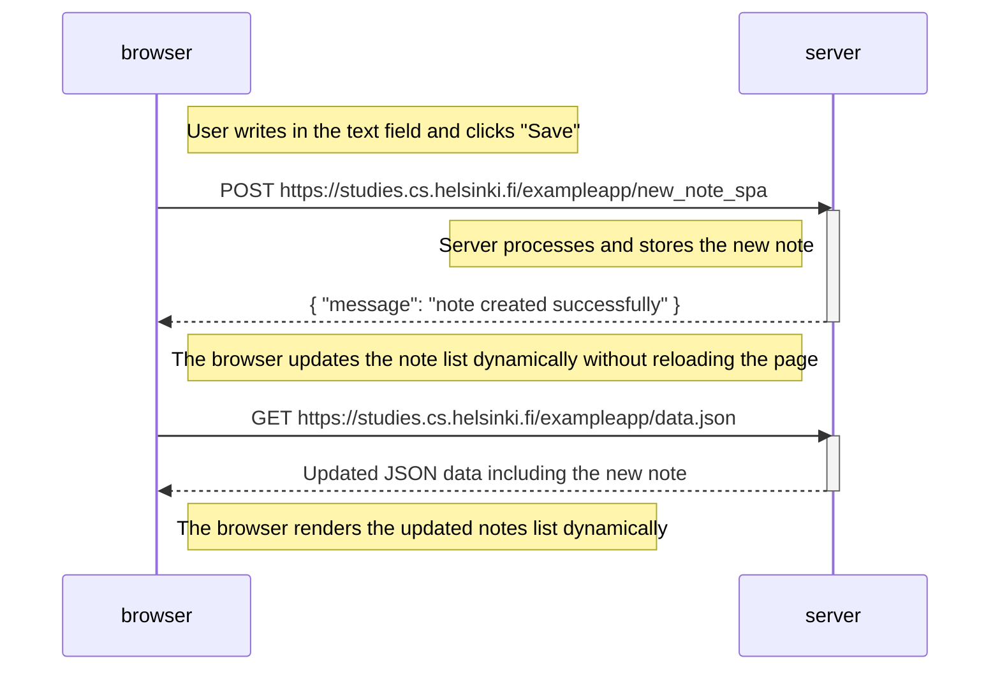

```mermaid

sequenceDiagram
    participant browser
    participant server

    Note right of browser: User writes in the text field and clicks "Save"

    browser->>server: POST https://studies.cs.helsinki.fi/exampleapp/new_note_spa
    activate server
    Note left of server: Server processes and stores the new note
    server-->>browser: { "message": "note created successfully" }
    deactivate server

    Note right of browser: The browser updates the note list dynamically without reloading the page
    browser->>server: GET https://studies.cs.helsinki.fi/exampleapp/data.json
    activate server
    server-->>browser: Updated JSON data including the new note
    deactivate server

    Note right of browser: The browser renders the updated notes list dynamically


```